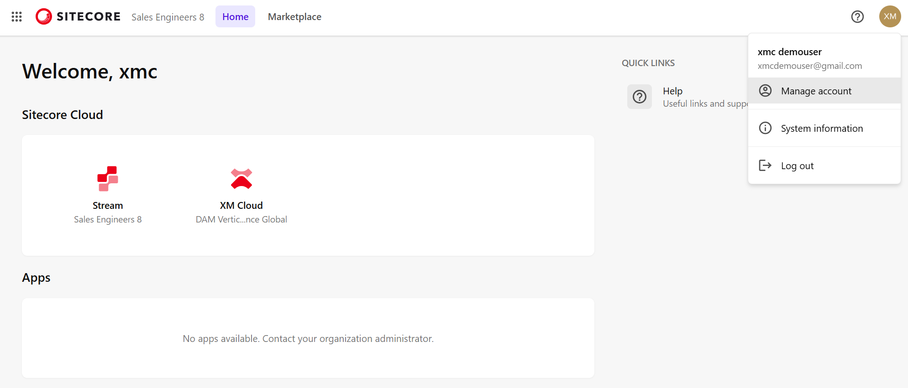

# Navigation

Browse around the pages and see what pretty designs you can build with Sitecore

### Login to Sitecore portal



<figure><figcaption></figcaption></figure>

* Top menu - Your organization , links for Home and Admin part of XM Cloud
* Welcome
  * Navigate to Stream
  * Navigate to XM Cloud
* Quick Links
  * XM Cloud Deploy
  * Invite team members (restricted during trial)
  * Help
  * Create support ticket (restricted during trial)

### Navigate to XM Cloud

* Select Open app

<figure><figcaption></figcaption></figure>

* XM Cloud app with ready made site based on Sync music template

<figure><figcaption></figcaption></figure>


Refer XM Cloud Documentation for navigation items [https://doc.sitecore.com/xmc/en/users/xm-cloud/sitecore-xm-cloud.html#xm-cloud-homepage](https://doc.sitecore.com/xmc/en/users/xm-cloud/sitecore-xm-cloud.html#xm-cloud-homepage)


* Select the site -> <mark style="color:$success;">**Page builder**</mark> action

<figure><figcaption></figcaption></figure>

**Congratulations! You have successfully completed this task. Kindly fill out the feedback form and proceed to the next task.**


